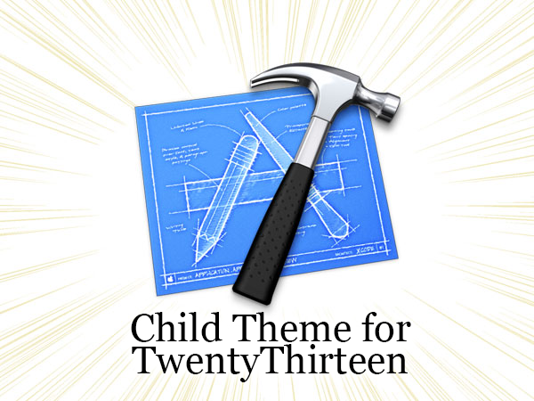

# Pinkstone 2013
WordPress Child Theme for TwentyThirteen used on my iOS Dev Diary at https://pinkstone.co.uk

# Features
- modified header so that a graphic can be displayed without resizing issues on mobile
- Table of Contents functionality
- removed Jetpack upsell messages in admin interface
- removed word hyphenation (but left link hyphenation in place)
- dedicated page templates to list articles in specific categories
- word count feature for Table of Contents
- adds the Apple Podcasts and Stitcher Bagdes underneath respective categories

# Plugins
I use a number of plugins to make the rest of the site tick:

- Crayon for code highlighting
- BluBrry PowerPress for podcasting
- 2013 Header Ad to insert Google Analytics and Auto Ads code
- Akistmet and Jetpack
- WP Retina 2x
